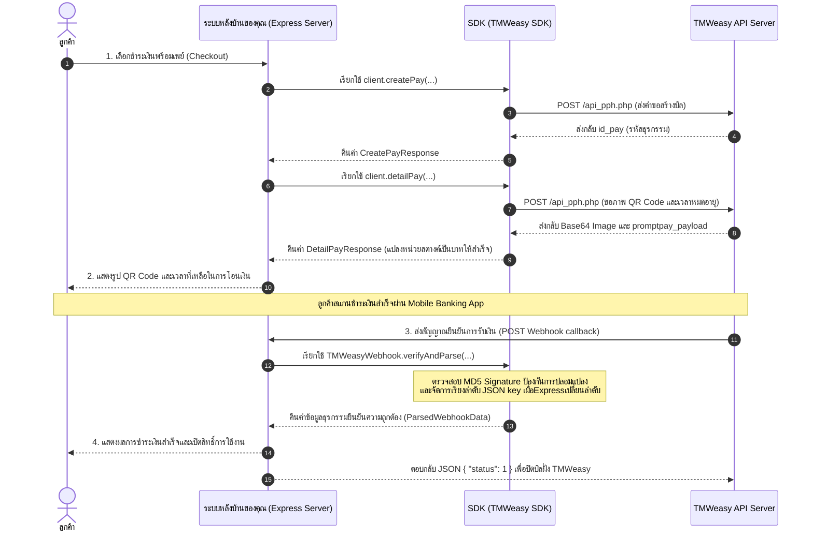
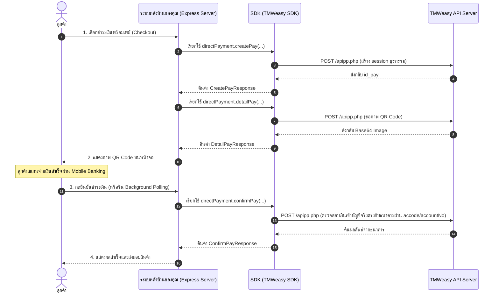

# 🇹🇭 @riiixch/tmweasy-qr-payment 💸

[](https://www.npmjs.com/package/@riiixch/tmweasy-qr-payment)
[](#)
[](https://www.typescriptlang.org)
[](#)
[](https://github.com/riiixch)

> **สร้างและตรวจสอบระบบรับชำระเงิน PromptPay QR Code ผ่าน TMWeasy API ด้วย SDK แยกสองระบบสมบูรณ์ 100% สำหรับ Webhook (Event-Driven) และ Direct Bank (accode Check) ที่มีความปลอดภัยสูงในระดับ Enterprise-grade สำหรับ TypeScript & Node.js**

---

## 💡 แก้ไขปัญหาอะไร? (What Problem Does This Solve?)

การเชื่อมต่อระบบรับเงินพร้อมเพย์ด้วยตัวเองมักมีข้อจำกัดที่ท้าทายต่อนักพัฒนาตลอดเวลา SDK ตัวนี้แก้จุดอ่อนทั้งหมดโดยนำเสนอ **2 ระบบการเชื่อมต่อแยกออกจากกันโดยสมบูรณ์** เพื่อให้นักพัฒนาเลือกใช้งานตามสถาปัตยกรรมของโครงการของตนเองอย่างชัดเจน:

### 1️⃣ ระบบ Webhook Flow (`TMWeasyQRPaymentWebhook`)
*   **รูปแบบการทำงาน**: ลูกค้าสแกนจ่ายเงิน -> TMWeasy ยิงคำขอยืนยันสัญญากลับมาที่ endpoint ของคุณ -> ตรวจสอบลายเซ็น MD5 Signature ทันที
*   **แก้ไขปัญหา**: 
    *   **Smart Key Sorting**: ปรับแก้ปัญหาการสลับตำแหน่งของคีย์ JSON ยามผ่าน Express parsing middleware ด้วยระบบ Fallback Key Sorting อัตโนมัติ ทำให้การคำนวณตรวจสอบลายเซ็นถูกต้อง 100%
    *   **หน่วยสตางค์**: แปลงหน่วยสตางค์จาก API เป็นหน่วยบาท (`amount_baht` ตัวเลข float 2 ตำแหน่ง) ให้พร้อมเสิร์ฟทันทีใน Callback

### 2️⃣ ระบบ Direct Bank Flow (`TMWeasyQRPayment`)
*   **รูปแบบการทำงาน**: ดึงข้อมูลและตรวจสอบยอดโอนโดยตรงกับบัญชีธนาคารของคุณผ่าน **accode** (รหัสเข้ารหัสธนาคาร) และ **accountNo** (เลขบัญชีธนาคาร 10 หลัก) ได้ทันทีแบบ Real-time โดยไม่ต้องพึ่ง Webhook
*   **แก้ไขปัญหา**: 
    *   **รองรับ E-Wallet (ประเภท "03")**: ดึงข้อมูลและคำนวณ EMVCo Payload สำหรับ PromptPay E-Wallet ID ความยาว 10-20 หลัก (เช่น KBANK/SCB E-Wallet) พร้อมกับเบอร์โทรศัพท์และเลขบัตรประชาชนได้โดยตรง
    *   **ความแม่นยำสูง**: ไม่จำเป็นต้องรอการยิง callback เข้ามา สามารถทำ Polling หรือยิง Check ยอดเงินแบบเรียลไทม์ฝั่งหลังบ้านได้อย่างเด็ดขาด

---

## 🌟 จุดเด่นของแพ็กเกจ (Key Features)

*   **100% TypeScript & Strict Type Safety**: พัฒนาด้วย TypeScript ทุกบรรทัด **ไม่มีการใช้ `any` เด็ดขาด** 🛡️
*   **Zero Core Dependencies**: ไร้แพ็กเกจภายนอกในระบบแกนหลัก (อาศัย Native Node `fetch` และ `crypto`) รวดเร็วและปราศจากช่องโหว่ความปลอดภัย
*   **Independent Module Configs**: แยกการตั้งค่าคอนฟิก `TMWeasyQRPaymentWebhookConfig` และ `TMWeasyQRPaymentConfig` ออกจากกันโดยสิ้นเชิง ป้องกันการใส่ข้อมูลปะปน
*   **Automatic Retry & Backoff**: ติดตั้งระบบยิงความพยายามใหม่แบบทวีคูณ (Exponential Backoff) เมื่อตรวจพบเครือข่ายขัดข้องชั่วขณะ ป้องกันระบบหยุดทำงานเมื่อเน็ตหลุด
*   **Console QR Generator (ANSI)**: วาดรูปสแกน QR Code พร้อมเพย์ลงบน Terminal ได้ทันทีผ่านการเรียกใช้งานเบาๆ ช่วยให้เปิดจอมือถือสแกนจ่ายทดสอบระบบได้ในเวลาไม่ถึง 1 วินาที!

---

## 📊 ขั้นตอนการทำงานของระบบ (System Architecture & Flows)

เพื่อความเข้าใจในขั้นตอนการแลกเปลี่ยนข้อมูลของทั้งสองระบบ สามารถดูแผนภาพลำดับการทำงาน (Sequence Diagram) ด้านล่างนี้:

### 🔄 1. Webhook Flow (Event-Driven)


### ⚡ 2. Direct Bank Flow (Direct Check with accode)


---

## 📦 การติดตั้ง (Installation)

```bash
npm install @riiixch/tmweasy-qr-payment
```

### 🔒 ⚙️ การตั้งค่าสภาพแวดล้อมและความปลอดภัย (Environment & Security Setup)

เพื่อความปลอดภัยระดับสูงสุดในสภาวะการใช้งานจริง (Production) **ห้ามเขียนข้อมูลเชื่อมต่อที่เป็นความลับ (Credentials) ลงในโค้ดโดยตรงเด็ดขาด** แนะนำให้ใช้ตัวแปรสภาพแวดล้อมผ่านไฟล์ `.env` เสมอ:

1. ติดตั้งแพ็กเกจช่วยโหลดค่าตัวแปรสภาพแวดล้อม:
```bash
npm install dotenv
```

2. สร้างไฟล์ `.env` ไว้ที่โฟลเดอร์หลักของโปรเจกต์:
```env
TMWEASY_USERNAME=your_username
TMWEASY_PASSWORD=your_password
TMWEASY_CON_ID=your_con_id
TMWEASY_API_KEY=your_api_key

# สำหรับระบบ Direct Bank Flow เท่านั้น
TMWEASY_ACCODE=your_accode_from_settings
TMWEASY_ACCOUNT_NO=0123456789
```

3. เรียกใช้ในโค้ดของคุณ:
```typescript
import dotenv from 'dotenv';
import { TMWeasyQRPaymentWebhook } from '@riiixch/tmweasy-qr-payment';

dotenv.config();

const client = new TMWeasyQRPaymentWebhook({
  username: process.env.TMWEASY_USERNAME!,
  password: process.env.TMWEASY_PASSWORD!,
  conId: process.env.TMWEASY_CON_ID!
});
```

---

## 🚀 1. คู่มือการใช้ Webhook Flow (`TMWeasyQRPaymentWebhook`)

ระบบนี้เหมาะสำหรับโครงการที่ใช้สถาปัตยกรรมแบบ **Event-Driven** โดยให้ฝั่งเซิร์ฟเวอร์หลักของ TMWeasy ส่งสัญญาณ Webhook เพื่ออนุมัติบิล

### โค้ดตัวอย่าง Express Server สมบูรณ์แบบ (Webhook Flow)

```typescript
import express from 'express';
import { TMWeasyQRPaymentWebhook, TMWeasyWebhook, AutoCancelHandle } from '@riiixch/tmweasy-qr-payment';

const app = express();
const API_KEY = 'your_tmweasy_api_key'; // ค้นหาได้ในหน้าเซ็ตติ้ง TMWeasy

// ตั้งค่า Client Webhook (ชี้ไปที่ api_pph.php อัตโนมัติ)
const client = new TMWeasyQRPaymentWebhook({
  username: 'your_username',
  password: 'your_password',
  conId: 'your_con_id',
  retryOptions: {
    retries: 3,       // พยายามยิงส่งซ้ำสูงสุด 3 ครั้งยามเน็ตหลุด
    minTimeout: 1000, // เวลารอบแรก 1 วินาที
    factor: 2         // คูณเวลารอแบบทวีคูณ (1s -> 2s -> 4s)
  }
});

// แผนที่สำหรับเก็บงานนับถอยหลังยกเลิก (Active Cancellers Map)
const activeCancellers = new Map<string, AutoCancelHandle>();

// 1️⃣ ขอชำระเงิน: สร้างและแสดงผล QR Code พร้อมจำกัดเวลา
app.post('/api/checkout-webhook', async (req, res) => {
  try {
    // Step 1: ขอรหัสชำระเงิน
    const session = await client.createPay({ amount: 50, ref1: 'order_12345', ip: '127.0.0.1' });
    
    // Step 2: สร้างรูป QR Code และดึงเวลาหมดอายุ
    const qrData = await client.detailPay({
      idPay: session.id_pay!,
      promptpayId: '0812345678', // เบอร์พร้อมเพย์รับเงินของคุณ
      type: '01'                 // '01' = เบอร์โทรศัพท์, '02' = บัตรประชาชน
    });

    if (qrData.status === 1 && qrData.time_out) {
      // ⏳ สั่งตั้งเวลาทำการยกเลิกบิลอัตโนมัติเมื่อหมดเวลา
      const handle = client.scheduleAutoCancel(session.id_pay!, qrData.time_out, {
        onSuccess: (response) => console.log(`[ID ${session.id_pay}] ถูกยกเลิกอัตโนมัติสำเร็จ:`, response.msg),
        onError: (err) => console.error(`[ID ${session.id_pay}] ล้มเหลวในการยกเลิกอัตโนมัติ:`, err.message)
      });

      // บันทึกตัวควบคุมเก็บไว้ด้วย ID Pay
      activeCancellers.set(session.id_pay!, handle);
    }

    res.json({
      success: true,
      amount: qrData.amount_baht,       // ยอดเงินโอนจริงในหน่วยบาท (แปลงทศนิยมให้เสร็จ)
      qrBase64: qrData.qr_image_base64, // รูปพร้อมเพย์แสดงผล  ได้เลย
      timeLeft: qrData.time_out         // วินาทีคงเหลือในการชำระ
    });
  } catch (error: any) {
    res.status(400).json({ error: error.message });
  }
});

// 2️⃣ รับ Webhook: เมื่อลูกค้าจ่ายสำเร็จ ตรวจลายเซ็นและหยุดตัวนับเวลาถอยหลังทันที
app.post('/webhook/payment', express.json(), (req, res) => {
  try {
    // Step 3: ตรวจสอบความถูกต้องของ Signature
    const verified = TMWeasyWebhook.verifyAndParse(req.body, API_KEY);

    if (verified.status === 1) {
      console.log(`🎉 ได้รับการโอนเงินจำนวน ${verified.amount_baht} บาทสำเร็จ!`);
      
      // 🛑 หยุดตัวจับเวลานับถอยหลังยกเลิกทันที (ลูกค้าทำเสร็จสมบูรณ์!)
      const handle = activeCancellers.get(verified.id_pay);
      if (handle) {
        handle.stop();
        activeCancellers.delete(verified.id_pay);
      }

      // จัดส่งเครดิต/สินค้าให้ผู้จ่ายในส่วนนี้...
    }

    res.status(200).json({ status: 1 });
  } catch (error: any) {
    console.error('ลายเซ็นไม่ถูกต้องหรือเกิดการบุกรุก!', error.message);
    res.status(403).json({ error: 'Unauthorized signature' });
  }
});

app.listen(3000, () => console.log('Server Webhook running on port 3000'));
```

---

## 🚀 2. คู่มือการใช้ Direct Bank Flow (`TMWeasyQRPayment`)

เหมาะสำหรับโครงการที่อยาก **ยืนยันการโอนเงินกับบัญชีธนาคารโดยตรง (Direct Check)** ผ่านธนาคารโดยใช้ `accode` (ไม่ต้องพึ่งสัญญาณ Webhook จากภายนอก)

### โค้ดตัวอย่าง Express Server สมบูรณ์แบบ (Direct Bank Flow)

```typescript
import express from 'express';
import { TMWeasyQRPayment, AutoCancelHandle } from '@riiixch/tmweasy-qr-payment';

const app = express();

// ตั้งค่า Client ยืนยันยอดตรง (ชี้ไปที่ apipp.php อัตโนมัติและรองรับ HTTPS)
const directPayment = new TMWeasyQRPayment({
  username: 'your_username',
  password: 'your_password',
  conId: 'your_con_id',
  accode: 'your_accode_from_settings', // ใส่ที่นี่เพื่อใช้เป็นค่ากลางสะดวกๆ
  accountNo: '0123456789'              // เลขบัญชีธนาคารรับเงิน 10 หลัก
});

const activeCancellers = new Map<string, AutoCancelHandle>();

// 1️⃣ ลูกค้าเปิดยอด: สร้างสิทธิ์และภาพ QR Code (รองรับ E-Wallet "03")
app.post('/api/checkout-direct', async (req, res) => {
  try {
    // Step 1: สร้าง session การชำระเงิน
    const session = await directPayment.createPay({
      amount: 150, // จำนวนเงินหน่วยบาท
      ref1: 'direct_order_998',
      ip: '127.0.0.1'
    });

    // Step 2: สร้างบิลและรับ QR Code ภาพพร้อม EMVCo payload
    const qrData = await directPayment.detailPay({
      idPay: session.id_pay!,
      promptpayId: '140001234567890', // E-Wallet ID หรือเบอร์พร้อมเพย์รับเงิน
      type: '03'                       // '01' = มือถือ, '02' = บัตรประชาชน, '03' = E-Wallet ID
    });

    if (qrData.status === 1 && qrData.time_out) {
      // ⏳ สั่งตั้งเวลานับถอยหลังยกเลิกอัตโนมัติหากไม่จ่ายในเวลา
      const handle = directPayment.scheduleAutoCancel(session.id_pay!, qrData.time_out, {
        onSuccess: () => console.log(`[ID ${session.id_pay}] สั่งยกเลิกสำเร็จเนื่องจากหมดเวลา`),
        onError: (err) => console.error(`[ID ${session.id_pay}] สั่งยกเลิกเมื่อหมดเวลาล้มเหลว:`, err.message)
      });
      activeCancellers.set(session.id_pay!, handle);
    }

    res.json({
      success: true,
      idPay: session.id_pay,
      qrBase64: qrData.qr_image_base64,
      timeLeft: qrData.time_out
    });
  } catch (error: any) {
    res.status(400).json({ error: error.message });
  }
});

// 2️⃣ ปุ่มกดตรวจสอบยอด/หรือรัน Polling: ยืนยันเงินโอนกับธนาคารโดยตรง (Step 3 - confirm)
app.post('/api/verify-payment', async (req, res) => {
  const { idPay, clientIp } = req.body;

  try {
    // Step 3: สั่งเช็คยืนยันยอดเงินผ่านรหัส accode และเลขบัญชีธนาคารโดยตรง
    const verification = await directPayment.confirmPay({
      idPay: idPay,
      ip: clientIp, // IP ของลูกค้าขณะกดยืนยันตัวตน
      // accode และ accountNo จะถูกดักดึงจาก Config โดยอัตโนมัติ หรือส่ง override ตรงนี้ได้
    });

    if (verification.status === 1) {
      console.log(`🎉 ธนาคารตอบกลับ: ยอดเงิน ${verification.amount} บาท โอนสำเร็จจริงในวันที่ ${verification.date_pay}!`);
      
      // 🛑 หยุดตัวจับเวลานับถอยหลังยกเลิกทันที (จ่ายเงินเสร็จเรียบร้อย!)
      const handle = activeCancellers.get(idPay);
      if (handle) {
        handle.stop();
        activeCancellers.delete(idPay);
      }

      return res.json({ success: true, message: 'ชำระเงินสำเร็จแล้ว!' });
    } else {
      return res.json({ success: false, message: verification.msg || 'ยังไม่พบยอดเงินโอนเข้าบัญชี' });
    }
  } catch (error: any) {
    res.status(400).json({ error: error.message });
  }
});

app.listen(3001, () => console.log('Server Direct Bank running on port 3001'));
```

---

## ⚡ ฟีเจอร์ขั้นสูงสำหรับธุรกิจ (Advanced Business Utilities)

### 1. การวาดภาพ QR Code ใน Terminal (ANSI Console QR Code)
สำหรับนักพัฒนาที่ต้องการนำ EMVCo payload มาสั่งสแกนทดสอบจ่ายเงินจริงผ่าน Console หน้าต่างระหว่างพัฒนาแอปพลิเคชัน

> [!NOTE]
> ฟีเจอร์นี้ต้องติดตั้งแพ็กเกจ `qrcode` ในเครื่องก่อนใช้งาน:
> ```bash
> npm install qrcode
> ```

```typescript
import { renderQRToConsole } from '@riiixch/tmweasy-qr-payment';

// นำ promptpay_payload ที่ได้จากเมธอด detailPay มาแสดงผล
if (qrData.status === 1 && qrData.promptpay_payload) {
  await renderQRToConsole(qrData.promptpay_payload);
}
```

### 2. การจัดการข้อยกเว้นและข้อผิดพลาด (Exception Handling)
SDK นี้โยนข้อผิดพลาดที่มีคลาสระบุตัวตนชัดเจน ทำให้ดักครอบ `try-catch` และควบคุมระบบหลักไม่ให้หยุดทำงานได้ง่าย:

*   **`TMWeasyValidationError`**: ข้อมูลนำเข้าฝั่งหลังบ้านผิดพลาด (เช่น ยอดเงินไม่ใช่เลขจำนวนเต็ม หรือเบอร์โทรศัพท์/เลขบัญชีไม่ตรงจำนวนหลัก)
*   **`TMWeasyAPIError`**: ได้รับข้อความปฏิเสธจาก API ฝั่งปลายทาง (status เป็น 0) หรือปัญหาเน็ตหลุด
*   **`TMWeasySignatureError`**: สัญญาณเตือนภัยด้านความมั่นคง: ลายเซ็น MD5 Webhook ไม่ตรงกับที่ถอดรหัสผ่าน API Key

```typescript
import { TMWeasyValidationError, TMWeasyAPIError, TMWeasyError } from '@riiixch/tmweasy-qr-payment';

try {
  await directPayment.confirmPay({ idPay: '123', ip: '127.0.0.1', accountNo: 'bad_number' });
} catch (error) {
  if (error instanceof TMWeasyValidationError) {
    console.error(`ข้อมูลผิดปกติที่ช่อง "${error.field}":`, error.message);
  } else if (error instanceof TMWeasyAPIError) {
    console.error(`มีปัญหาการสื่อสาร API (HTTP ${error.statusCode}):`, error.message);
  } else if (error instanceof TMWeasyError) {
    console.error('ข้อผิดพลาดทั่วไปของ SDK:', error.message);
  }
}
```

---

## 📘 ข้อมูลอ้างอิง API และประเภทข้อมูล (API & Type References)

### ⚙️ 1. รายละเอียดการตั้งค่าคอนฟิก (Configuration References)

#### 🔄 Webhook Client (`TMWeasyQRPaymentWebhook`)
```typescript
const client = new TMWeasyQRPaymentWebhook(config: TMWeasyQRPaymentWebhookConfig);
```
| Property | Type | Required | Description | Default |
|---|---|:---:|---|---|
| `username` | `string` | **Yes** | ชื่อผู้ใช้งานระบบ TMWeasy | - |
| `password` | `string` | **Yes** | รหัสผ่านระบบ TMWeasy | - |
| `conId` | `string` | **Yes** | รหัสเชื่อมต่อ (Connection ID) ที่ได้จากหน้าตั้งค่าของ TMWeasy | - |
| `baseUrl` | `string` | No | ลิงก์เชื่อมต่อ API Webhook | `'http://tmwallet.thaighost.net/api_pph.php'` |
| `retryOptions`| `RetryOptions` | No | การตั้งค่าลองใหม่อัตโนมัติเมื่อเกิดการล้มเหลวของเครือข่าย | - |

#### ⚡ Direct Bank Client (`TMWeasyQRPayment`)
```typescript
const direct = new TMWeasyQRPayment(config: TMWeasyQRPaymentConfig);
```
| Property | Type | Required | Description | Default |
|---|---|:---:|---|---|
| `username` | `string` | **Yes** | ชื่อผู้ใช้งานระบบ TMWeasy | - |
| `password` | `string` | **Yes** | รหัสผ่านระบบ TMWeasy | - |
| `conId` | `string` | **Yes** | รหัสเชื่อมต่อ (Connection ID) ที่ได้จากหน้าตั้งค่าของ TMWeasy | - |
| `accode` | `string` | No | คีย์เข้ารหัสบัญชีธนาคาร (ดักข้ามตรวจสอบยอด) | - |
| `accountNo` | `string` | No | เลขบัญชีธนาคาร 10 หลักรับเงิน | - |
| `baseUrl` | `string` | No | ลิงก์เชื่อมต่อ API ตรวจสอบยอดตรง | `'https://tmwallet.thaighost.net/apipp.php'` |
| `retryOptions`| `RetryOptions` | No | การตั้งค่าลองใหม่อัตโนมัติเมื่อเกิดการล้มเหลวของเครือข่าย | - |

---

### 📦 2. โครงสร้างประเภทข้อมูล (Data Interfaces Reference)

#### 🏷️ `RetryOptions`
ตัวเลือกสำหรับการพยายามยิงคำขอใหม่อัตโนมัติ (Exponential Backoff):

| Property | Type | Required | Description | Default |
|---|---|:---:|---|---|
| `retries` | `number` | No | จำนวนครั้งสูงสุดที่จะทดลองยิงคำขอใหม่เมื่อระบบเครือข่ายขัดข้อง | `0` (ไม่พยายามซ้ำ) |
| `minTimeout` | `number` | No | เวลารอบแรกที่จะรอในหน่วยมิลลิวินาทีก่อนจะกดยิงคำขอซ้ำรอบสอง | `1000` (1 วินาที) |
| `factor` | `number` | No | ตัวคูณทวีคูณสำหรับการหน่วงเวลาในรอบถัดไป (เช่น 1s -> 2s -> 4s) | `2` |

---

#### 🏷️ `CreatePayOptions` (ข้อมูลส่งเข้าของ `createPay`)
ตัวเลือกพารามิเตอร์สำหรับขอเปิดสิทธิ์บิลพร้อมเพย์:

| Property | Type | Required | Description |
|---|---|:---:|---|
| `amount` | `number` | **Yes** | จำนวนเงินที่ต้องการเรียกเก็บในหน่วยบาท **ต้องเป็นเลขจำนวนเต็มเท่านั้น** (เช่น `50`) |
| `ref1` | `string` | **Yes** | รหัสอ้างอิงของลูกค้าของคุณ (เช่น Username, User ID, รหัสคำสั่งซื้อ หรืออีเมล) |
| `ip` | `string` | **Yes** | หมายเลข IP Address ของฝั่งไคลเอนต์ผู้ใช้บริการ |

#### 🏷️ `CreatePayResponse` (ข้อมูลตอบกลับจาก `createPay`)
ผลลัพธ์การดำเนินการขอจองบิลธุรกรรม:

| Property | Type | Presence | Description |
|---|---|:---:|---|
| `status` | `0 \| 1` | **Always** | สถานะของ API (`1` = ทำรายการสำเร็จพร้อมไปขั้นตอนที่ 2, `0` = ล้มเหลว) |
| `id_pay` | `string` | Optional | รหัสธุรกรรมอ้างอิงจาก TMWeasy (ได้รับเฉพาะเมื่อ `status: 1`) |
| `msg` | `string` | Optional | ข้อความระบุสาเหตุความผิดพลาดจากฝั่ง API (ได้รับเฉพาะเมื่อ `status: 0`) |

---

#### 🏷️ `DetailPayOptions` (ข้อมูลส่งเข้าของ `detailPay`)
ตัวเลือกข้อมูลการขอรับภาพและชุดรหัส EMVCo เพื่อวาด QR Code:

| Property | Type | Required | Description |
|---|---|:---:|---|
| `idPay` | `string \| number` | **Yes** | ไอดีอ้างอิงธุรกรรม `id_pay` ที่ได้จากผลการรัน `createPay` |
| `promptpayId` | `string` | **Yes** | หมายเลข ID บัญชีพร้อมเพย์ที่ผูกกับธนาคารของคุณเพื่อใช้รับเงินค่าสินค้า |
| `type` | `'01' \| '02' \| '03'` | **Yes** | ชนิดของข้อมูลพร้อมเพย์ (`'01'` = เบอร์โทรศัพท์, `'02'` = เลขบัตรประชาชน, `'03'` = E-Wallet ID) |

#### 🏷️ `DetailPayResponse` (ข้อมูลตอบกลับจาก `detailPay`)
รายละเอียดบิลสำหรับแสดงผลรูป QR ให้ฝั่งไคลเอนต์นำไปสแกนจ่ายเงิน:

| Property | Type | Presence | Description |
|---|---|:---:|---|
| `status` | `0 \| 1` | **Always** | สถานะการทำงานจาก API (`1` = สำเร็จ, `0` = เกิดปัญหาขัดข้อง) |
| `ref1` | `string` | Optional | รหัสลูกค้าที่คุณระบุไว้ตอนจองบิล |
| `amount_check` | `string` | Optional | ยอดเงินชำระในหน่วยสตางค์ (เช่น `"5000"`) |
| `amount_baht` | `number` | Optional | **ยอดเงินรวมในหน่วยบาท** ที่ SDK แปลงทศนิยม float 2 ตำแหน่งให้เสร็จเรียบร้อย (เช่น `50.00`) |
| `qr_image_base64` | `string` | Optional | ภาพ QR Code พร้อมเพย์แบบ Base64 สำหรับแทรกใส่แท็ก `` |
| `promptpay_payload` | `string` | Optional | ชุดโค้ดรหัสมาตรฐาน EMVCo PromptPay Payload สำหรับนำไปวาดภาพหรือแสดงผล QR บนอุปกรณ์อื่น |
| `time_out` | `number` | Optional | เวลาคงเหลือในหน่วยวินาทีที่บิลนี้จะยังใช้งานได้ (เมื่อหมดเวลา/บิลจะหมดอายุ) |
| `msg` | `string` | Optional | ข้อความสาเหตุความล้มเหลวจาก API |

---

#### ⚡ 🏷️ `ConfirmPayOptions` (ข้อมูลส่งเข้าของ `confirmPay` - เฉพาะ Direct Bank)
พารามิเตอร์ตรวจสอบยอดเงินเข้าธนาคารโดยอ้างอิงจากรหัสบิลและบัญชีธนาคาร:

| Property | Type | Required | Description |
|---|---|:---:|---|
| `idPay` | `string \| number` | **Yes** | รหัสธุรกรรมบิล `id_pay` |
| `ip` | `string` | **Yes** | หมายเลข IP Address ของเครื่องผู้ใช้บริการในขณะร้องขอยืนยันธุรกรรม |
| `accountNo` | `string` | No | เลขบัญชีธนาคารรับเงิน 10 หลัก (หากไม่มีการกำหนดไว้ใน config ส่วนกลาง) |
| `accode` | `string` | No | รหัส Token เข้ารหัสรับรองของธนาคาร (หากไม่มีการกำหนดไว้ใน config ส่วนกลาง) |

#### ⚡ 🏷️ `ConfirmPayResponse` (ข้อมูลตอบกลับจาก `confirmPay` - เฉพาะ Direct Bank)
ผลการตรวจสอบยอดเงินเข้าบัญชีธนาคารของคุณโดยตรงแบบ Real-time:

| Property | Type | Presence | Description |
|---|---|:---:|---|
| `status` | `0 \| 1` | **Always** | สถานะจากธนาคาร (`1` = พบยอดเงินโอนเข้าสำเร็จ, `0` = ยอดเงินยังไม่เข้าบัญชีหรือหมดเวลาธุรกรรม) |
| `ref1` | `string` | Optional | รหัสอ้างอิงของคุณที่ส่งมาตอนสร้างบิล |
| `amount` | `number` | Optional | **ยอดเงินจำนวนบาทจริงที่ลูกค้าโอนเข้ามา** (ชนิดตัวเลขทศนิยม float) |
| `date_pay` | `string` | Optional | วันและเวลาที่ยอดเงินได้รับการยืนยันเข้าบัญชีในรูปแบบ `"YYYY-MM-DD HH:mm"` |
| `msg` | `string` | Optional | รายละเอียดข้อผิดพลาดเพิ่มเติมจากเซิร์ฟเวอร์ |

---

#### 🔄 🏷️ `ParsedWebhookData` (ข้อมูลแกะกล่องของ Webhook callback - เฉพาะ Webhook)
โครงสร้างออบเจกต์ผลลัพธ์หลังถอดรหัส Webhook และได้รับการรับรองลายเซ็นถูกต้องสมบูรณ์:

| Property | Type | Description |
|---|---|---|
| `id_pay` | `string` | หมายเลขบิลธุรกรรมของระบบ TMWeasy |
| `ref1` | `string` | รหัสอ้างอิงลูกค้าที่คุณกำหนดไว้ตอนสร้างบิลครั้งแรก |
| `amount_check` | `string` | ยอดเงินชำระจริงในหน่วยสตางค์ (เช่น `"1901"`) |
| `amount` | `string` | ยอดเงินชำระจริงในหน่วยบาทชนิดข้อความตัวอักษร (เช่น `"19.01"`) |
| `amount_baht` | `number` | **ยอดเงินชำระจริงในหน่วยบาทที่แปลงเป็น Number (ทศนิยม) ให้เรียบร้อยเพื่อการคำนวณ** |
| `date_pay` | `string` | วันและเวลาที่โอนเงินสำเร็จจากสลิปของระบบธนาคาร รูปแบบ `"YYYY-MM-DD HH:mm"` |

---

## 👥 ผู้พัฒนา (Developer Credit)

*   **RIIIXCH** (Developer & Creator)
    *   **GitHub Profile:** [@riiixch](https://github.com/riiixch)
    *   **GitHub Repository:** [tmweasy-qr-payment](https://github.com/riiixch/tmweasy-qr-payment)

---

## 📄 ใบอนุญาต (License)

ชุดคำสั่งและโค้ดภายในโครงการนี้อยู่ภายใต้ข้อตกลงใบอนุญาต [ISC License](LICENSE).
